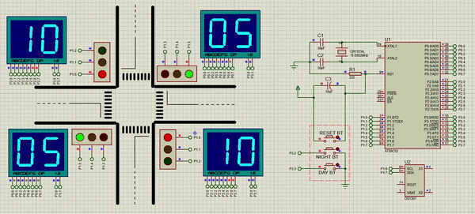

# traffic-light
Traffic light control system is my project in the course Microprocessors at Hanoi University of Science and Technology. I used the Intel MCS-51/8051 microcontroller and the programming language was assembly. I2C protocal was used for communication between components.
I developed source codes in Keil C and simulated the circuit in Proteus. 
Generally, it has two modes: day and night.  

*Please give me a ⭐ if you find it useful.*

