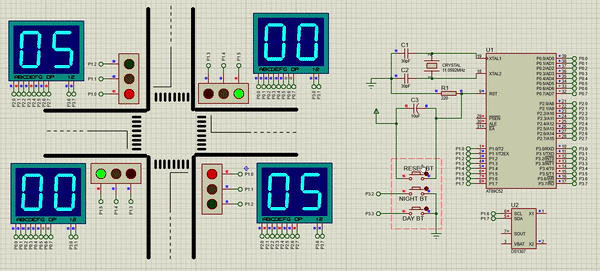

# traffic-light
Traffic light control system (The Intel MCS-51/8051 microcontroller programming in assembly language) is my project in the course Microprocessors at Hanoi University of Science and Technology.
I programmed in Keil C and simulated the circuit in Proteus.
Please give me a ⭐ if you find it useful.

